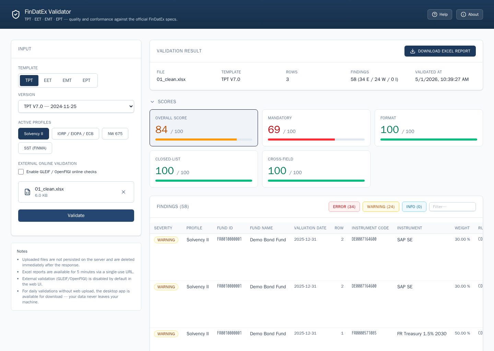

# FinDatEx Validator

> ## ⚠️ Disclaimer — please read first
>
> This is **not an official FinDatEx tool**. It is a private,
> open-source side project, not affiliated with, endorsed by, or
> connected to the FinDatEx initiative or any of its member
> organisations. "FinDatEx", "TPT", "EET", "EMT", and "EPT" are
> referenced here only to describe the data templates the tool tries
> to validate.
>
> The validator is provided **as-is, without warranty of any kind** —
> no guarantee of completeness, correctness, regulatory fitness, or
> compatibility with any particular spec version. Validation results
> may be incomplete or wrong. **Do not rely on this tool as the sole
> check** before delivering data to a counterparty or regulator.
>
> See [`LICENSE`](LICENSE) for the full legal text (Apache 2.0).

---

## What it does

Loads a FinDatEx data-template file (TPT, EET, EMT or EPT) and checks
it against the official spec: missing mandatory fields, wrong formats,
invalid codes, broken cross-field rules, and so on. You get a quality
score (0–100) and a downloadable Excel report with one row per finding
so you can fix things in your source system.

Bundled templates: **TPT V7.0 + V6.0**, **EET V1.1.3 + V1.1.2**,
**EMT V4.3 + V4.2**, **EPT V2.1 + V2.0**.

---

## How to use it

There are two ways. Pick whichever is more convenient — the
validation engine is exactly the same.

### Option A — Web app (no install)

> **Public URL:** <https://findatex-validator-web-274755042473.europe-west3.run.app/>

1. Open the URL in your browser.
2. Pick the template (TPT / EET / EMT / EPT) and version.
3. Drag your `.xlsx`, `.xlsm` or `.csv` file onto the upload area
   (max 25 MB).
4. Click **Validieren**. You get findings on screen and a download
   link for the Excel report.

The hosted instance has no login. Files are processed in memory and
discarded the moment the response is sent; the report download link
is single-use and expires after 5 minutes.

### Option B — Desktop app (recommended for confidential data)

The desktop app reads files from your local disk, validates them
locally, and writes the report locally. No upload, no network traffic
except an optional GLEIF / OpenFIGI lookup that you opt in to in the
settings dialog.

Pre-built native installers for every release are attached to the
[GitHub Releases page](https://github.com/karlkauc/findatex-validator/releases).
Two flavours per platform:

| Platform           | Installer (admin)                                | Portable (no admin)                                  |
|--------------------|--------------------------------------------------|------------------------------------------------------|
| Linux x64          | `findatex-validator-<v>-linux-x64.deb`           | `findatex-validator-<v>-linux-x64.tar.gz`            |
| Windows x64        | `findatex-validator-<v>-windows-x64.msi`         | `findatex-validator-<v>-windows-x64.zip`             |
| macOS Apple Silicon | `findatex-validator-<v>-macos-arm64.dmg`        | `findatex-validator-<v>-macos-arm64.tar.gz`          |
| macOS Intel        | `findatex-validator-<v>-macos-x64.dmg`           | `findatex-validator-<v>-macos-x64.tar.gz`            |

The installers are **unsigned**, so the OS will warn on first launch.
Override the warning once and you're set:

- **macOS:** Right-click the `.app` → *Open* → confirm.
- **Windows:** *More info* → *Run anyway* on the SmartScreen prompt.

No Java install needed — the installers ship a bundled runtime.

---

## Privacy

| Mode | What happens to your data |
|------|---------------------------|
| **Desktop app** | Files stay on your machine. The only outbound call is the optional GLEIF / OpenFIGI lookup, which sends only the LEIs / ISINs from your file — never the full file. |
| **Hosted web app** | Files are processed in memory and discarded immediately after the response. Reports live for 5 minutes via a single-use URL, then are deleted. No login, no per-file logging. External validation off by default. |

For confidential fund data, prefer the desktop app.

---

## Help

User-facing help — what gets validated, what the profiles mean, how
the GLEIF / OpenFIGI lookup works — is in
[`HELP.md`](core/src/main/resources/help/HELP.md). It is also
reachable from the **Help** button in either UI.

---

## For developers, contributors, and self-hosters

- [`INSTALL.md`](INSTALL.md) — build from source, package native
  installers locally, run the web app in dev mode, self-host with
  Docker, env-var reference.
- [`CONTRIBUTING.md`](CONTRIBUTING.md) — development setup, coding
  conventions, PR checklist, how to add a new template version.
- [`CLAUDE.md`](CLAUDE.md) — architectural map (module boundaries,
  validation flow, where each kind of code lives).
- [`docs/SPEC_DOWNLOADS.md`](docs/SPEC_DOWNLOADS.md) — operator
  checklist for acquiring spec XLSX files from FinDatEx.
- [`docs/SPEC_INVENTORY.md`](docs/SPEC_INVENTORY.md) — auto-maintained
  list of bundled spec files.
- [`samples/`](samples/) — per-template scenario fixtures (clean +
  broken variants).

---

## Security

Found a vulnerability? Please **do not open a public issue**. See
[`SECURITY.md`](SECURITY.md) and use GitHub's private vulnerability
reporting (Repository → *Security* → *Advisories* → *Report a
vulnerability*). The maintainer will acknowledge within 72 hours.

## Author

Created and maintained by **Karl Kauc**
([karl.kauc@gmail.com](mailto:karl.kauc@gmail.com),
[github.com/karlkauc](https://github.com/karlkauc)).
This is a private project — see the disclaimer at the top.

## License

Released under the [Apache License 2.0](LICENSE). You may use, modify,
and distribute the source under the terms of that license; the patent
grant in §3 applies to all contributions.

## Contributing

Bug reports, feature requests, and pull requests are welcome. See
[`CONTRIBUTING.md`](CONTRIBUTING.md) for the development setup, coding
conventions, and PR checklist, and
[`CODE_OF_CONDUCT.md`](CODE_OF_CONDUCT.md) for the community
standards. Security issues should be reported privately via the
process described in [`SECURITY.md`](SECURITY.md).
